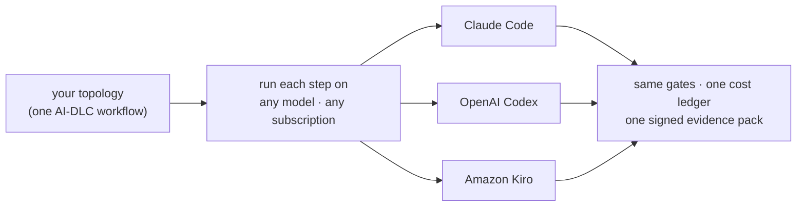
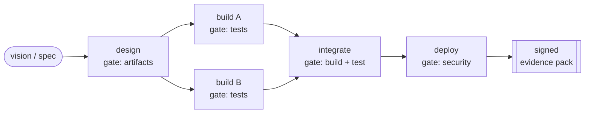

# Cadora

**One conductor for every coding agent.** Cadora drives the top frontier models — **Claude Code,
OpenAI Codex, Amazon Kiro**, and more — through a single declared workflow, on the **subscriptions
you already pay for**, following the **AWS AI-DLC** method, and it **proves** what got built. It
sits *above* the vendors: neutral verdicts, one cost ledger, no lock-in.

Cadora is the **conductor, not the agent** — it doesn't implement the agent loop (the backend CLI
does) and isn't an in-IDE assistant. It's the layer that turns *"an AI wrote it"* into a run you can
**repeat, compare, cost, and prove**.

> Read the vision: [**The Neutral Conductor**](docs/vision.md) &nbsp;·&nbsp; or skim the
> [**one-page overview**](docs/index.html) — an interactive HTML version of this README (open in a browser)

## What Cadora gives you

**Every frontier model, one workflow.** Drive Claude Code, OpenAI Codex, and Amazon Kiro (plus
experimental GLM and Antigravity) through the *same* declared topology. A/B two models on identical
work and compare on equal terms, or **phase-split** a run — inception on one, construction on another
(`--construction-executor`). Adding a backend is one class; there's no lock-in. Use the best model
for each step.

**Run on the subscriptions you already pay for.** Subscription-funded by default — metered API is an
explicit opt-in, never a surprise bill — so a whole delivery runs on the seats you already have. Mix
vendors and funding sources, and get **one cross-vendor cost ledger**: `cadora usage` and the
dashboard's FinOps panel show what every run spent, by model, backend, funding source, and day.

**A real method, not a wall of prompts.** Cadora is aligned with the **AWS AI-DLC** lifecycle —
inception → construction → operations — so a run is a structured, phase-gated workflow you can reason
about and repeat. It's method-agnostic too: drive BMAD, or your own topology. (The AI-DLC and shape
topologies live in [`examples/`](examples/).)

**Proof you can ship.** *"It works"* is a claim — Cadora turns it into **evidence**. Deterministic,
fail-closed gates decide "green" from real exit codes and test counts (a suite that ran zero tests
is blocked; a package that won't build fails), tamper detection catches impersonated tools and hollow
stubbed-out code, and every run becomes a **signed, checksummed evidence pack** you can hand to an
auditor — verifiable after it leaves your machine. Fail-closed human review (`--hitl`) sits wherever
judgment is required.



*One topology, any model, on your own subscriptions — with one cost ledger and one signed proof.*

**Go deeper:** [the vision](docs/vision.md) · [how gates decide *green*](docs/verification-gates.md)

## How a run works

You declare the steps as a small YAML DAG. Cadora runs independent steps concurrently, gates each
one, and rolls the whole run into a single signed evidence pack.



Runnable topologies for each shape — sequential, parallel fan-out, fan-in, a prep phase, and a
deploy target — live in [`examples/`](examples/).

## Backends

Three backends are **verified** — live-smoke-checked against their CLI contract every release;
`glm` and `antigravity` are **experimental** — they run, but aren't in the release smoke yet.
`cadora doctor` prints each backend's tier and whether its installed version is in the tested range.

| Backend | Tier | Drive | Notes |
|---|---|---|---|
| `claude` (default) | verified | `claude -p`, structured stream-json | **subscription-funded by default**; metered API is explicit opt-in (`--funding api`) |
| `codex` | verified | `codex exec --json`, structured JSONL | uses your Codex login/plan |
| `kiro` | verified | `kiro-cli chat --no-interactive` | bills **subscription credits** (shown in FinOps); live-verified on 2.10.0 |
| `glm` | experimental | Z.ai's Anthropic-compatible endpoint behind the `claude` CLI | `ZAI_API_KEY`; Anthropic credentials are stripped from the env; dollars from the public Z.ai rate table (flagged `est.`) |
| `antigravity` | experimental | Google's `agy` CLI | recovers each response from the agy transcript (agy's stdout is unreliable) |
| `fixture` | test-only | local, deterministic, offline | demos, CI smoke, policy-safe HITL walkthroughs — no model call |

Every backend runs the **same topology, gates, integrity evaluation, and archive**, so their
results A/B-compare directly — including phase-split runs (`--executor claude
--construction-executor codex`). The `NodeExecutor` seam makes a new backend one class.

## Methods are packs — AI-DLC is the flagship

Cadora ships the [AWS AI-DLC method](https://github.com/awslabs/aidlc-workflows) (AI-Driven
Development Life Cycle, MIT-0) as its built-in flagship workflow: `cadora aidlc-init` installs
the rule-set into your workspace (`CLAUDE.md` for Claude Code, `AGENTS.md` for Codex — existing
project instructions are preserved outside a managed block), and the example topologies drive
🔵 Inception → 🟢 Construction → Build & Test from a `vision.md`. The method is a **pack, not the
product**: any workflow you can express as a topology of gated nodes conducts the same way.

**EXPERIMENTAL — aidlc-workflows 2.0 pack.** `cadora aidlc-init <ws> --method aidlc-v2` installs
upstream's v2 engine (pinned tag, **commit-verified** — a moved tag fails the install) with a
guarded twist: upstream's defaults silently re-point every session at **Bedrock us-east-1 with
`opus[1m]` at `xhigh` effort** and wire five remote MCP servers; the installer **strips those
pins by default and records exactly what it stripped** in `.cadora-aidlc-v2.json` (restore with
`--keep-provider-pins` / `--keep-mcp`). Then drive `/aidlc` yourself in Claude Code, and inspect
the run any time — read-only — with:

```bash
cadora aidlc-audit ./my-project          # state + 68-event audit trail summary
cadora aidlc-audit ./my-project --json   # full structured events (gates, sensors, human turns)
```

Requires `bun` (v2's hooks; `cadora doctor` checks it). The full external driver for v2 is
deliberately deferred while upstream's GA preview stabilizes its gate surface.

## Install

Requires **Python 3.10+** and at least one authenticated backend CLI
([`claude`](https://docs.claude.com/claude-code) or
[`codex`](https://developers.openai.com/codex/cli/)):

```bash
pip install cadora
```

From source: `git clone https://github.com/yeychenne/cadora.git && cd cadora && python3 -m venv
.venv && source .venv/bin/activate && pip install -e ".[dev]"`.

## Quickstart

Run these commands from a clone of this repository so the `examples/` files are present.

```bash
# 0. Check your backend CLIs against the tested contract ranges (offline, no model calls).
cadora doctor

# 1. Set up a workspace from your product vision (installs the AI-DLC method pack).
cadora aidlc-init ./my-project --vision vision.md

# 2. Drive the workflow on Claude Code — autonomous, gated, subscription-funded.
cadora run examples/aidlc.topology.yaml --vision vision.md --cwd ./my-project

# 3. Read the evidence — package it, judge it, compare it.
cadora archive ls
cadora archive show <run-id>
cadora report <run-id>         # portable evidence pack: html + json + sha-256 checksums
cadora eval <run-id>           # deterministic verdict + CI-friendly exit code
cadora eval <run-id> --judge   # + opt-in LLM rubric (advisory; any backend; never overrides)
cadora compare <run-a> <run-b> # per-node outcome/model/cost diff — the measured A/B
cadora deliverable <run-id>    # client-facing delivery report (markdown; --docx / --pptx optional)
cadora usage                   # tokens + dollars/credits by model / backend / funding
cadora dashboard               # local cockpit: DAG cost/quality map + FinOps panel
```

A/B the same spec on Codex:

```bash
cadora run examples/aidlc.topology.yaml \
  --executor codex --model gpt-5.5 \
  --integrity-mode repair \
  --vision vision.md --cwd ./my-project
```

Split phases across vendors (design on Claude, code on Codex):

```bash
cadora run examples/aidlc-phased.topology.yaml \
  --executor claude \
  --construction-executor codex --construction-model gpt-5.5 \
  --vision vision.md --cwd ./my-project
```

Scan any existing workspace for toolchain tampering — no agent run required:

```bash
cadora integrity ./my-project [--json]
```

## Gate mechanics worth knowing

The gate distinguishes a real failure from an unavailable prerequisite. Python workspaces that
declare dev requirements get a cached isolated gate environment (`.cadora/gate-venv`); your
`--gate-cmd` runs unchanged inside it. If provisioning is impossible, the archive records
`blocked_prerequisite` + the missing packages instead of misreporting the application as broken.
Offline: `--gate-wheelhouse /path/to/wheels`; opt out with `--gate-setup off`.

## Security model — read before pointing it at your code

Cadora **audits the agent's output** (deterministic gates, integrity checks, evidence) — it does
**not sandbox the agent's execution**. An autonomous run drives the backend with
`--dangerously-skip-permissions` inside your `--cwd`: the agent reads, writes, and runs commands
there with your user's permissions, and gates may install dependencies (executing agent-authored
build hooks). So:

- **Point Cadora only at a trusted or throwaway workspace** — a fresh directory, a git worktree,
  or a container. Not your home directory, not a repo with secrets in it.
- **Keep credentials out of that environment.** Executors drop ambient provider keys where they
  can (e.g. the `claude` backend strips a stray `ANTHROPIC_API_KEY` in subscription mode), but the
  workspace itself is the agent's to touch.
- Every autonomous run prints a blast-radius banner and, interactively, asks once to proceed;
  CI/automation bypasses with `--yes` or `CADORA_ASSUME_YES=1`.
- The **dashboard and MCP server are localhost-only with no authentication.** Cadora refuses to
  bind either to a non-loopback host unless you pass `--i-understand-no-auth` — front them with
  TLS + auth before exposing them. See [docs/dashboard.md](docs/dashboard.md).
- The pre-publish **leak scan is a codename denylist, not a general secrets scanner** — it guards
  *our* release hygiene, it is not a substitute for your own secret-scanning on generated code.

New to Cadora, or bringing it to a hackathon? Start with the
[getting started guide](docs/getting-started.md), the
[hackathon quickstart](docs/hackathon-quickstart.md) (5 commands), and the
[5-minute demo script](docs/demo-script-5min.md). Curious how gates decide *green*? Read the
[verification-gates whitepaper](docs/verification-gates.md).

## Status

**v0.10.1** — the capstone release (0.10.1 corrects per-node duration telemetry under
`--max-parallel`; cost and tokens were always accurate). One conductor across **every frontier model** (claude / codex /
kiro verified, plus experimental), running on **the subscriptions you already pay for** with one
cross-vendor cost ledger, driving a **real method** (AWS AI-DLC, or your own), and leaving **proof
you can ship**: evidence packs are now **signed** as well as checksummed — `cadora sign` /
`cadora verify` add a detached signature over the SHA-256 manifest (OpenSSH by default, pluggable;
`verify` exits non-zero on tamper or a bad signature), so a green run is tamper-evident **and
attributable**. Backends carry explicit **support tiers** (`cadora doctor`), the MCP HTTP transport
takes a **bearer token**, and a release **secrets scanner** guards every build. Ships a full
**topology examples library** across all three lifecycle phases — a mission-prep prep phase (Senior
PM ∥ DE), the three canonical DAG shapes, and a security-gated AgentCore deploy target — plus the
[vision paper](docs/vision.md) and a [one-page overview](docs/index.html). On **v0.8.x**'s
run-detail dashboard, headless HITL, run resumption (`--resume-from`), and the packaging
false-green fix; **v0.7.x**'s per-gate commands, parallel waves, and drive-to-completion
(`--remediate`); and v0.6.0's evidence pack, `eval` (+ judge), `compare`, `deliverable`, `doctor`.
270+ tests, `ruff` clean, CI on Python 3.10–3.12.

> **v0.9.0 is superseded and yanked** — it was published from an incomplete pre-release build (the
> code was correct; the packaged docs were stale). Use **v0.10.0**.

**Roadmap:** dependency lockfile hardening, a
backend contract matrix, a container sandbox wrapper, and additional backend/method packs as they
earn verification.

## License

MIT. The vendored AI-DLC rule-set is MIT-0 (`awslabs/aidlc-workflows`).
