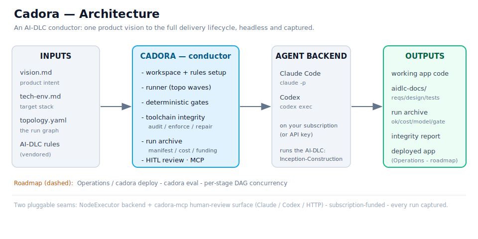
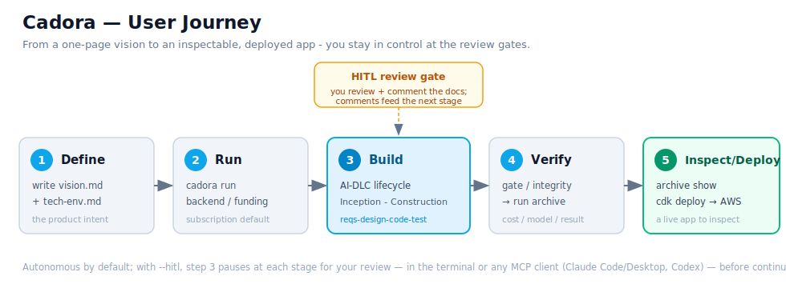
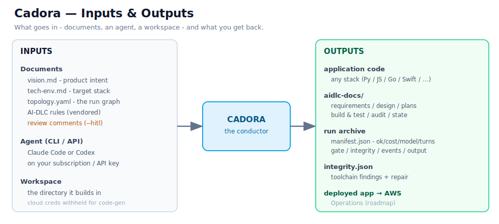

# Cadora — Diagrams

A visual overview of Cadora. The SVGs render on GitHub and embed in the docs / beta package.

## Architecture

Inputs (`vision.md`, `tech-env.md`, `topology.yaml`, vendored AI-DLC rules) feed the **Cadora
conductor**, which drives a coding-agent backend (Claude Code / Codex, on your subscription) through
the AI-DLC lifecycle and emits working code, `aidlc-docs/`, and a captured run archive. Deterministic
gates + toolchain-integrity checks guard each run. Human review at the gates is pluggable — the
terminal or any MCP client (Claude Code/Desktop, Codex, remote HTTP).

## User journey

Define → Run → Build (AI-DLC) → Verify → Inspect/Deploy. Autonomous by default; with `--hitl`,
explicit `review: true` stages pause for approve/revise/abort decisions — in the terminal or any
MCP client — before downstream work.
Build step pauses at each AI-DLC stage so you can **review and comment the documents** before it
continues (the method favors these reviews).

## Inputs & outputs

Inputs: documents, the agent CLI (your subscription/API), and a workspace. Outputs: application code
(any stack), `aidlc-docs/`, the run archive (`manifest.json`, events, output), an integrity report,
and — on the Operations roadmap — a deployed app.
